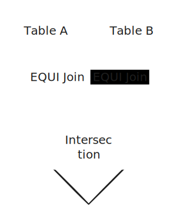

# Two Pointer

## Sliding Window 란?

***

투포인터 알고리즘에 들어가기 앞서, 슬라이딩 윈도우 알고리즘에 대해 살펴봐야 합니다.

슬라이딩 윈도우 알고리즘이란, 고정된 윈도우(영역)를 옮기며 윈도우 내에 있는 데이터를 활용하여 문제를 해결하는 기법을 말합니다.



이때, 윈도우는 **고정된 크기**를 가지게 되며, 윈도우 이동 시 이전 단계 윈도우와 교집합 영역에 있는 요소들은 공유하고 변동되는 양 끝 요소만 갱신하며 진행되게 됩니다.

### Sliding Window 구현

슬라이딩 윈도우의 경우 아래와 같이 구현할 수 있습니다.

```cpp
// N : 전체 배열 크기, W : 윈도우 크기
int max_sum = 0; // 연속된 W 크기의 영역의 요소들의 합 중 가장 큰 값
for(int i = 0; i < W; i++) { // [1] 초기 index = 0 ~ W - 1 까지의 합
    max_sum += arr[i];
}
int sum = max_sum; // 현재 영역 요소들의 합
for(int i = 0; i < N - W; i++) { // [2] 윈도우를 옮기며 진행
    sum += arr[i + W]; // 맨 뒤 값 갱신
    sum -= arr[i]; // 맨 앞 값 갱신
    max_sum = max(max_sum, sum); // 현재 영역의 합과 기존 최대 합 비교
}
cout << max_sum; // N 배열에서 최대 합
```

위 예시의 경우 연속된 W 크기의 영역에 요소들의 합이 최대가 되는 경우의 값을 구하는 문제입니다.

#### \[1] 시작 영역 초기화

슬라이딩 윈도우의 경우 반드시 초기 영역에 대한 할당이 선행되어 있어야 합니다.

이에 초기 인덱스 0부터 W - 1 까지의 합을 구하고 초기화합니다.

#### \[2] 윈도우 이동 후 갱신

이후, 윈도우를 이동하며 슬라이딩 윈도우를 진행하게 됩니다.

이때 현재 윈도우의 모든 값을 더하는 것이 아닌 이전 영역에서 교집합이 아닌 부분만을 갱신하며 진행합니다.

위 예시의 경우 1씩 이동하고 있으므로, 이전 영역에서 맨 앞의 값은 빼주고, 현재 영역에서 추가되는 맨 뒤 값은 더하며 갱신합니다.


## Two Pointer

***

투 포인터는 앞서 살펴본 [#sliding-window-1](two-pointer.md#sliding-window-1 "mention")과 유사하게 구현합니다.

하지만 **윈도우의 영역이 고정되지 않는다**는 점이 슬라이딩 윈도우와의 차이점입니다.

투 포인터의 경우 윈도우의 크기를 고정하지 않고 조건에 따라 유동적으로 윈도우 시작 지점과 끝 지점을 이동하며 진행하는 알고리즘입니다.

또한, 슬라이딩 윈도우와 마찬가지로 이전 단계의 윈도우와 교집합되는 영역은 갱신하지 않고 공유하며 진행합니다.

### Two Pointer 구현

투 포인터 알고리즘은 아래와 같이 구현할 수 있습니다.

```cpp
for(int i = 0; i < N; i++) {
    ....
}
```
